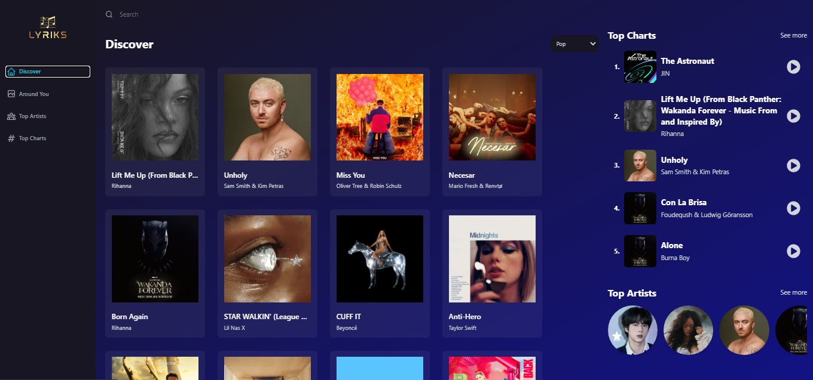

<h1 align="center"> Clone Spotify </h1>

Lyrics app

  <a href="#-tecnologias">Tecnologias</a>&nbsp;&nbsp;&nbsp;|&nbsp;&nbsp;&nbsp;
  <a href="#-projeto">Projeto</a>&nbsp;&nbsp;&nbsp;|&nbsp;&nbsp;&nbsp;
  <a href="#-layout">Layout</a>&nbsp;&nbsp;&nbsp;|&nbsp;&nbsp;&nbsp;

 

  

## 🚀 Tecnologias

Esse projeto foi desenvolvido com as seguintes tecnologias:

- React
- Redux
- Vite
- <a href="https://rapidapi.com/tipsters/api/shazam-core/">Rappid Api - Shazam core</a>
- <a href="https://geo.ipify.org/docs">Geo ipfy Api</a>
- [Node e NPM](https://nodejs.org/)
- Tailwindcss

## 💻 Projeto

---
